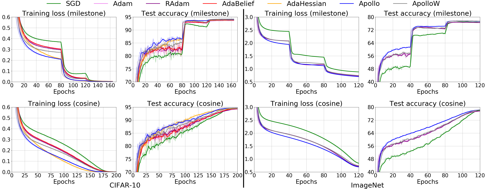
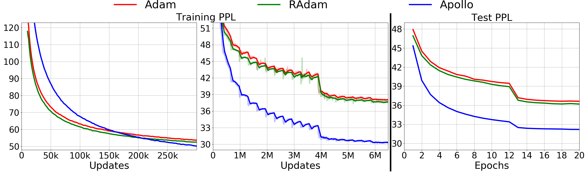
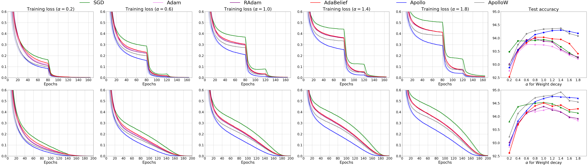

[](https://opensource.org/licenses/Apache-2.0)

<h1 align="center">Apollo</h1>
<h5 align="center">Apollo: An Adaptive Parameter-wise Diagonal Quasi-Newton Method for Nonconvex Stochastic Optimization</h5>

This is the Pytorch implementation for [Apollo: An Adaptive Parameter-wise Diagonal Quasi-Newton Method for Nonconvex Stochastic Optimization](https://arxiv.org/abs/2009.13586)

## Table of Contents

- [Requirements](#requirements)
- [Installation](#installation)
- [Notes](#notes)
- [Experiments](#experimental-results)
- [Discussion](#discussion)

## Requirements
* Python >= 3.6
* Pytorch >= 1.5.0
* apex
* lmdb >= 0.94
* overrides 
* tqdm


## Installation
1. Install [NVIDIA-apex](https://github.com/NVIDIA/apex).
2. Install [Pytorch and torchvision](https://pytorch.org/get-started/locally/)

## Notes
- In the latest version of **Apollo**, we changed `sigma` from `1.0` to `0.01` to make its learning rate in a suitable range, not that different with previous algorithms (see out [paper](https://arxiv.org/abs/2009.13586) for details). 
To apply Apollo to your tasks, a reasonable set of hyper parameters to begin with is ```lr=0.01, eps=1e-4, init_lr=1e-5, warmup=500```.
- Warmup plays a super important role for Apollo. Please set warmup to at least `100` updates to achieve stable convergence.

## Experimental Results

### Image Classification


| Method     |  CIFAR-10 (%)      |  CIFAR-10 (%)      |  ImageNet (%)      |  ImageNet (%)      |
| :--------- | :----------------: | :----------------: | :----------------: | :----------------: |
|            |  **milestone**     |  **cosine**        |  **milestone**     |  **cosine**        |
| SGD        |  93.94 (0.07)      |  94.53 (0.27)      |  77.57 (0.07)      |  78.26 (0.08)      |
| Adam*      |  91.41 (0.30)      |  91.56 (0.19)      |  71.72 (0.13)      |  71.19 (0.10)      |
| RAdam*     |  91.80 (0.04)      |  91.88 (0.15)      |  72.37 (0.08)      |  71.64 (0.14)      |
| Adam       |  93.74 (0.15)      |  94.24 (0.09)      |  76.86 (0.06)      |  77.54 (0.16)      |
| RAdam      |  93.88 (0.11)      |  94.38 (0.25)      |  76.91 (0.07)      |  77.68 (0.08)      |
| AdaBelief  |  94.03 (0.11)      |  94.51 (0.07)      |  77.55 (0.07)      |  78.22 (0.11)      |
| AdaHessian |  93.97 (0.22)      |  94.48 (0.17)      |  77.61 (0.09)      |  78.02 (0.10)      |
| **Apollo** |  **94.21 (0.08)**  |  **94.64 (0.09)**  |  **77.85 (0.07)**  |  **78.45 (0.06)**  |
| **ApolloW**|  **94.34 (0.12)**  |  **94.76 (0.07)**  |  **77.86 (0.09)**  |  **78.48 (0.07)**  |

We use [ResNet-110](https://github.com/bearpaw/pytorch-classification) for CIFAR-10 and standard ResNext-50 for ImageNet. 
Note that ResNet-110 is a modified version of ResNet-18 to adapt the small image size ```32x32``` in CIFAR-10.
ResNet-110 is much smaller than ResNet-18, with ```1.73M``` parameters (ResNet-18 has ```11.69M``` parameters).

The following table summarizes the key hyper-parameters for different optimizers. 
For the model training of image classification, please go to this [folder](https://github.com/XuezheMax/apollo/tree/master/classification).

**ResNet-110 on CIFAR-10**

|  Method    |    lr      |  weight decay  |  decoupled weight decay |  eps    | warmup updates  |  init_lr  |
| :--------- | :--------: | :------------: | :---------------------: | :-----: | :--------------: | :-------: |
|  SGD       |   0.1      |      5e-4      |         False           |   NA    |        0         |     NA    |
|  Adam*     |   0.001    |      5e-4      |         True            |  1e-8   |        0         |     NA    |
|  RAdam*    |   0.001    |      5e-4      |         True            |  1e-8   |        0         |     NA    |
|  Adam      |   0.001    |      2.5e-1    |         True            |  1e-8   |        0         |     NA    |
|  RAdam     |   0.001    |      2.5e-1    |         True            |  1e-8   |        0         |     NA    |
|  AdaBeleif |   0.001    |      2.5e-1    |         True            |  1e-8   |        0         |     NA    |
|  AdaHessian|   0.15     |      1e-3      |         True            |  1e-2   |       500        |    1e-3   |
|  Apollo    |   0.01     |      2.5e-4    |         False           |  1e-4   |       500        |    1e-5   |
|  Apollow   |   0.01     |      2.5e-2    |         True            |  1e-4   |       500        |    1e-5   |

**ResNext-50 on ImageNet**

|  Method    |    lr      |  weight decay  |  decoupled weight decay |  eps    |  warmup updates  |  init_lr  |
| :--------- | :--------: | :------------: | :---------------------: | :-----: | :--------------: | :-------: |
|  SGD       |   0.1      |      1e-4      |         False           |   NA    |        0         |     NA    |
|  Adam*     |   0.001    |      1e-4      |         True            |  1e-8   |        0         |     NA    |
|  RAdam*    |   0.001    |      1e-4      |         True            |  1e-8   |        0         |     NA    |
|  Adam      |   0.001    |      1e-1      |         True            |  1e-8   |        0         |     NA    |
|  RAdam     |   0.001    |      1e-1      |         True            |  1e-8   |        0         |     NA    |
|  Adabelief |   0.001    |      1e-1      |         True            |  1e-8   |        0         |     NA    |
|  AdaHessian|   0.15     |      1e-3      |         True            |  1e-2   |       500        |    1e-3   |
|  Apollo    |   0.01     |      1e-4      |         False           |  1e-4   |       500        |    1e-5   |
|  ApolloW   |   0.01     |      1e-2      |         True            |  1e-4   |       500        |    1e-5   |

Note that decoupled weight decay is applied to Adam, RAdam and AdaBelief. 


### Language Modeling


| Method     |  Test PPL        |
| :--------- | :--------------: |
| SGD        |  32.65 (0.13)    |
| Adam       |  36.68 (0.21)    |
| RAdam      |  36.20 (0.38)    |
| AdaBelief  |  32.83 (0.18)    |
| **Apollo** | **31.94 (0.09)** |

We use 2-layer LSTMs with ```2048``` hidden size on [One Billion Words](https://www.statmt.org/lm-benchmark/).
Some key hyper-parameters are listed in the following table. 
For the model training of language modeling, please go to this [folder](https://github.com/XuezheMax/apollo/tree/master/language_model).

**2-layer LSTM on One Billion Words**

|  Method    |    lr      |  weight decay  |  decoupled weight decay |  eps    |  warmup updates  |  init_lr  |  gradient clip  |
| :--------- | :--------: | :------------: | :---------------------: | :-----: | :--------------: | :-------: | :-------------: |
|  SGD       |   0.5      |      0         |         False           |   NA    |        0         |     NA    |      1.0        |
|  Adam      |   0.001    |      0         |         True            |  1e-8   |        0         |     NA    |      1.0        |
|  RAdam     |   0.001    |      0         |         True            |  1e-8   |        0         |     NA    |      1.0        |
|  AdaBelief |   0.001    |      0         |         True            |  1e-12  |        0         |     NA    |      1.0        |
|  Apollo    |   0.1      |      0         |         False           |  1e-4   |       500        |    1e-5   |      1.0        |

Since the weight decay rate is zero for all the optimizers, there is no difference between standard L2 regularization and decoupled weight decay.

### Neural Machine Translation

| Method     |  Test BLEU       |
| :--------  |  :-------------: |
| SGD        |  26.59 (0.07)    |
| Adam       |  27.84 (0.12)    |
| RAdam      |  28.15 (0.15)    |
| AdaBelief  |  28.14 (0.11)    |
| **Apollo** | **28.34 (0.10)** |

We use the Transformer-base models.
Some key hyper-parameters are listed in the following table.
For the details of NMT experiments, please go to this [repo](https://github.com/XuezheMax/fairseq-apollo).

**Transformer-base on WMT-14 En-De**

|  Method    |    lr      |  weight decay  |  decoupled weight decay |   eps   |    lr scheduler     |  warmup updates  |  init_lr  |  gradient clip  |
| :--------- | :--------: | :------------: | :---------------------: | :-----: | :-----------------: | :--------------: | :-------: | :-------------: |
|  SGD       |   0.1      |      1e-6      |         False           |    NA   |      milestone      |       1000       |    1e-4   |      1.0        |
|  Adam      |   0.0005   |      1e-4      |         True            |   1e-8  |    inverse sqrt     |       4000       |    1e-7   |      1.0        |
|  RAdam     |   0.0005   |      1e-4      |         True            |   1e-8  |      milestone      |        0         |     NA    |      1.0        |
|  AdaBelief |   0.0005   |      1e-4      |         True            |  1e-16  |      milestone      |       1000       |    1e-7   |      1.0        |
|  Apollo    |   0.1      |      1e-8      |         False           |   1e-4  |      milestone      |       1000       |    1e-5   |      1.0        |

## Discussion
**1. Weight Decay:**

-  The strength of `weight decay` has significant impact on both the performance of convergence speed and generalization accuracy.
Thus, as discussed in the paper, we suggest to consider the effect of regularization strength when we analyze the performance of different optimization methods.

- For adaptive optimizers, including Adam, RAdam and AdaBelief, different implementations of `weight decay`, such as the decoupled version, lead to very different regularization strength with the same `weight decay rate`.

- In this paper, for fair comparison, we comprehensively tune the `learning rate` and the `weight decay rate` for all the optimizers on CIFAR-10. 
For ImageNet, due to the resource limits, we kept all the hyper-parameters selected from CIFAR-10 for each optimizer, and only tuned the `weight decay rate`.
One motivation of this is to test the consistency of hyper-parameters of these optimizers on different tasks.

- We analyzed the effect of different `weight decay rates` on different optimizers. 
As illustrated in the figure, Apollo achieves improvements over all the three baselines on convergence speed with different rates of weight decay.



**2. Epsilon:**

We found that AdaBelief is very sensitive to the value of `epsilon`. 
In our experiments, Adam, RAdam and Apollo used a fixed `epsilon` for different tasks (`1e-8` for Adam and RAdam, and `1e-4` for Apollo).
But for AdaBelief, we had to finetune `epsilon` for different tasks, e.g. `1e-8` for image classification, `1e-12` for language modeling, and `1e-16` for neural machine translation.
With other values, the results of AdaBelief are even worse than Adam (e.g, we tried `1e-8` and `1e-16` for language modeling and the PPL points are higher than 37).
Thus, we suspected that the improvements of AdaBelief over Adam or RAdam mainly come from the fine-tuning of `epsilon`. 
Similar observations were reported in the [EAdam paper](https://arxiv.org/pdf/2011.02150.pdf).
