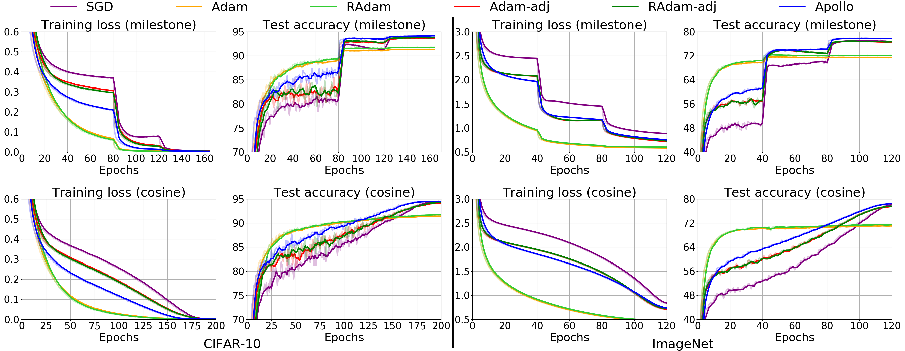

[](https://opensource.org/licenses/Apache-2.0)

<h1 align="center">Apollo</h1>
<h5 align="center">Apollo: An Adaptive Parameter-wise Diagonal Quasi-Newton Method for Nonconvex Stochastic Optimization</h5>

This is the Pytorch implementation for [Apollo: An Adaptive Parameter-wise Diagonal Quasi-Newton Method for Nonconvex Stochastic Optimization](https://arxiv.org/abs/2009.13586)

## Table of Contents

- [Requirements](#requirements)
- [Installation](#installation)
- [Notes](#notes)
- [Experiments](#experimental-results)
- [Discussion](#discussion)

## Requirements
* Python >= 3.6
* Pytorch >= 1.5.0
* apex
* lmdb >= 0.94
* overrides 
* tqdm


## Installation
1. Install [NVIDIA-apex](https://github.com/NVIDIA/apex).
2. Install [Pytorch and torchvision](https://pytorch.org/get-started/locally/)

## Notes
The ranges of hyper parameters of Apollo, such as learning rate, are very different with Adam (see the appendix of the paper for details). To apply Apollo to your tasks, a reasonable set of hyper parameters to begin with is ```lr=1.0, eps=1e-4, init_lr=0.01, warmup=100```.

## Experimental Results

### Image Classification


| Method     |  CIFAR-10 (%)      |  CIFAR-10 (%)      |  ImageNet (%)      |  ImageNet (%)      |
| :--------- | :----------------: | :----------------: | :----------------: | :----------------: |
|            |  **milestone**     |  **cosine**        |  **milestone**     |  **cosine**        |
| SGD        |  93.91 (0.07)      |  94.53 (0.27)      |  77.19 (0.07)      |  78.17 (0.06)      |
| Adam       |  91.41 (0.30)      |  91.56 (0.19)      |  71.72 (0.13)      |  71.19 (0.10)      |
| RAdam      |  91.80 (0.04)      |  91.88 (0.15)      |  72.37 (0.08)      |  71.64 (0.14)      |
| Adam-adj   |  93.74 (0.15)      |  94.24 (0.09)      |  76.86 (0.06)      |  77.54 (0.16)      |
| RAdam-adj  |  93.88 (0.11)      |  94.38 (0.25)      |  76.91 (0.07)      |  77.68 (0.08)      |
| **Apollo** |  **94.20 (0.12)**  |  **94.60 (0.06)**  |  **77.90 (0.06)**  |  **78.54 (0.09)**  |

We use [ResNet-110](https://github.com/bearpaw/pytorch-classification) for CIFAR-10 and standard ResNext-50 for ImageNet. 
Note that ResNet-110 is a modified version of ResNet-18 to adapt the small image size ```32x32``` in CIFAR-10.
ResNet-110 is much smaller than ResNet-18, with ```1.73M``` parameters (ResNet-18 has ```11.69M``` parameters).

The following table summarizes the key hyper-parameters for different optimizers. 
For the model training of image classification, please go to this [folder](https://github.com/XuezheMax/apollo/tree/master/classification).

#### ResNet-110 on CIFAR-10

|  Method    |    lr      |  weight decay  |  decoupled weight decay |  warmup updates  |  init_lr  |
| :--------- | :--------: | :------------: | :---------------------: | :--------------: | :-------: |
|  SGD       |   0.1      |      5e-4      |         False           |        0         |     NA    |
|  Adam      |   0.001    |      5e-4      |         True            |        0         |     NA    |
|  RAdam     |   0.001    |      5e-4      |         True            |        0         |     NA    |
|  Adam-adj  |   0.001    |      2.5e-1    |         True            |        0         |     NA    |
|  RAdam-adj |   0.001    |      2.5e-1    |         True            |        0         |     NA    |
|  Apollo    |   0.5      |      5e-4      |         False           |       100        |    0.01   |

#### ResNext-50 on ImageNet

|  Method    |    lr      |  weight decay  |  decoupled weight decay |  warmup updates  |  init_lr  |
| :--------- | :--------: | :------------: | :---------------------: | :--------------: | :-------: |
|  SGD       |   0.1      |      2e-4      |         False           |        0         |     NA    |
|  Adam      |   0.001    |      2e-4      |         True            |        0         |     NA    |
|  RAdam     |   0.001    |      2e-4      |         True            |        0         |     NA    |
|  Adam-adj  |   0.001    |      1e-1      |         True            |        0         |     NA    |
|  RAdam-adj |   0.001    |      1e-1      |         True            |        0         |     NA    |
|  Apollo    |   0.5      |      2e-4      |         False           |       100        |    0.01   |

### Language Modeling


| Method     |  Test PPL        |
| :--------- | :--------------: |
| Adam       |  36.68 (0.21)    |
| RAdam      |  36.20 (0.38)    |
| **Apollo** | **32.21 (0.13)** |

We use 2-layer LSTMs with ```2048``` hidden size on [One Billion Words](https://www.statmt.org/lm-benchmark/).
Some key hyper-parameters are listed in the following table. 
For the model training of language modeling, please go to this [folder](https://github.com/XuezheMax/apollo/tree/master/language_model).

**2-layer LSTM on One Billion Words**

|  Method    |    lr      |  weight decay  |  decoupled weight decay |  warmup updates  |  init_lr  |  gradient clip  |
| :--------- | :--------: | :------------: | :---------------------: | :--------------: | :-------: | :-------------: |
|  Adam      |   0.001    |      0         |         True            |        0         |     NA    |      1.0        |
|  RAdam     |   0.001    |      0         |         True            |        0         |     NA    |      1.0        |
|  Apollo    |   10.0     |      0         |         False           |       400        |    0.01   |      1.0        |

### Neural Machine Translation

| Method     |  Test BLEU       |
| :--------  |  :-------------: |
| Adam       |  27.83 (0.06)    |
| RAdam      |  28.11 (0.17)    |
| **Apollo** | **28.32 (0.12)** |

For the details of NMT experiments, please go to this [repo]().

## Discussion
